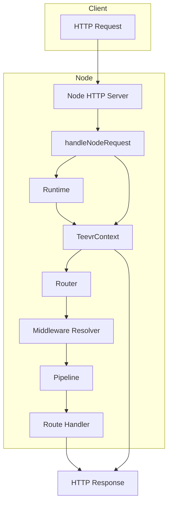
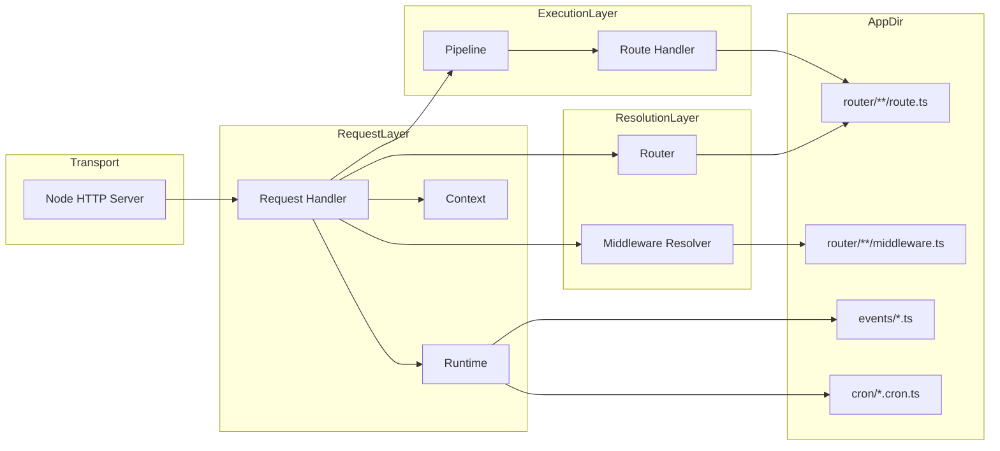
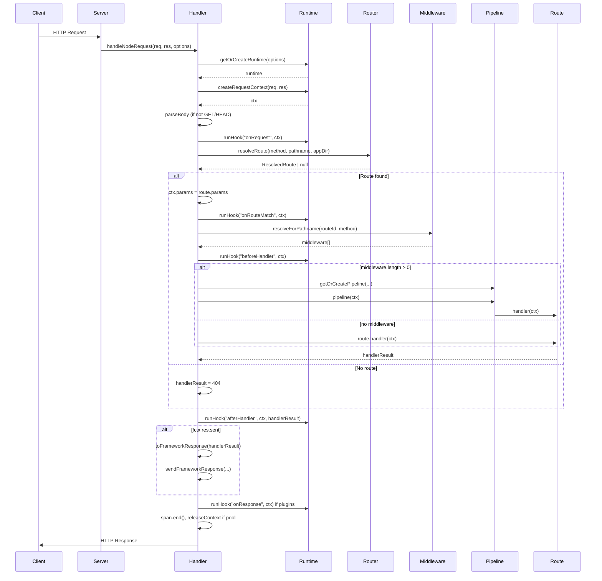
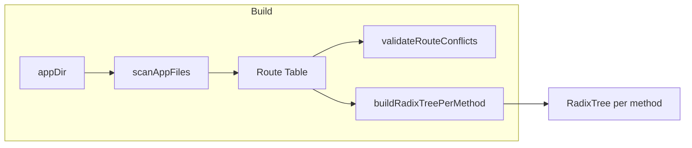
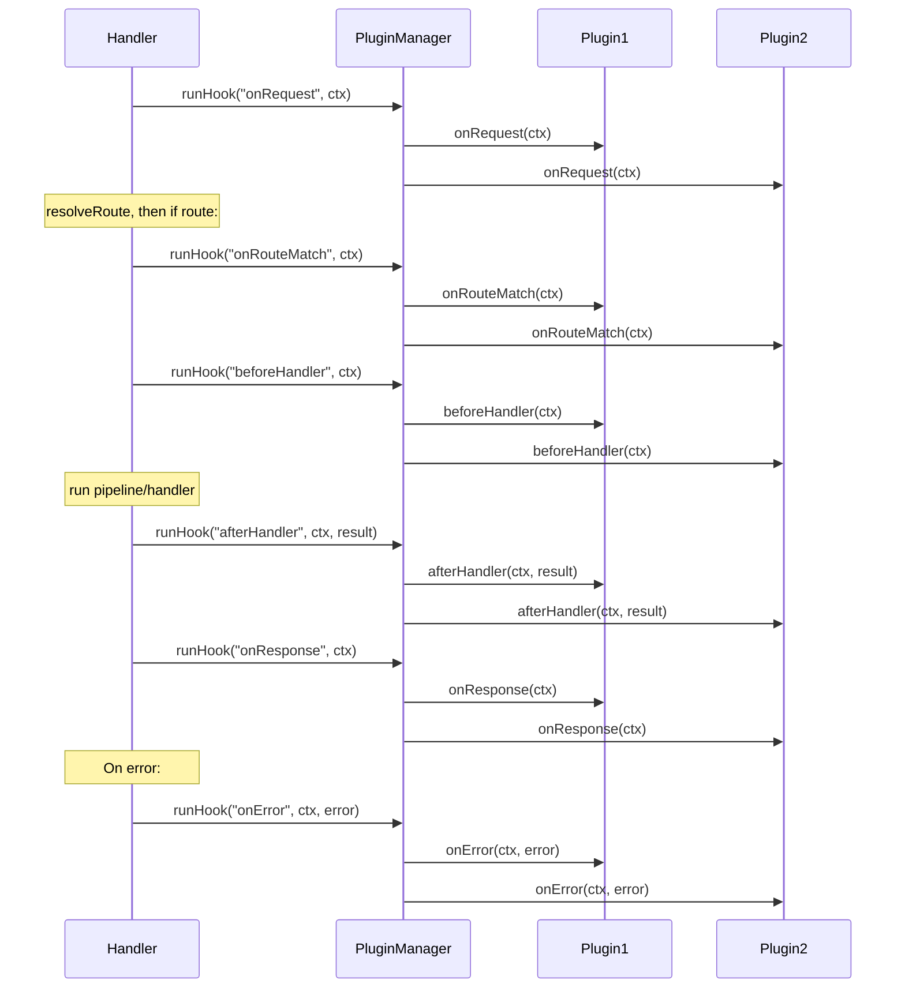

# Teevr Architecture

This document describes the complete architecture of Teevr: components, request lifecycle, routing, middleware, pipelines, caching, plugins, events, schedules, and development mode. It is structured for planning and onboarding: high-level overview first, then step-by-step flows and diagrams.

---

## 1. High-Level Architecture

Teevr is a file-based API framework. The **app directory** (`appDir`, default `./src`) is the root for events and cron, while **HTTP routes** and **middleware** are defined only under **`{appDir}/router/**`** (file paths under `router/` map to URL paths). The server is a thin Node HTTP server that delegates each request to a request handler; the handler obtains a **runtime** (per `appDir`), builds a **request context**, then runs through routing → middleware → handler → response.



### 1.1 Main components

| Component | Role |
|-----------|------|
| **Node HTTP Server** | `createNodeServer()` in `server/server.ts`. Listens on port/host; each request is passed to `handleNodeRequest`. |
| **Request handler** | `handleNodeRequest()` in `server/requestHandler.ts`. Parses URL/method/body, gets or creates runtime, creates context, runs CORS, routing, middleware, handler, and sends response. |
| **Runtime** | Per-`appDir` singleton. Creates request context (logger, trace, `emit`, `schedule`), holds event bus, schedule runner, plugin manager. Built once and cached. |
| **Context** | `TeevrContext`: `req`, `res`, `params`, `query`, `body`, `user`, `state`, `emit`, `schedule`, `logger`, `trace`. No built-in `db`; plugins or middleware can attach data. |
| **Router** | Resolves route by method + pathname using a per-method radix tree; returns `ResolvedRoute` (loaded route + params) or `null`. |
| **Middleware resolver** | Given route id (pathname) and method, returns ordered list of middleware file paths (ancestor path prefixes), then loads middleware from disk (cached). |
| **Pipeline** | Composed function: optional validation middleware + route middleware + route handler. Built per (appDir, pathname, method) and cached. |
| **Route handler** | Function exported from route file (e.g. `get`, `post`, `default`). Receives `ctx`, returns response shape or uses `ctx.res.json()` etc. |

### 1.2 Component diagram (layers)



---

## 2. Request Lifecycle (Step-by-Step)

End-to-end flow from an incoming HTTP request to the response.

### 2.1 Request lifecycle flow (flowchart)

```mermaid
flowchart TD
  A[HTTP Request] --> B[handleNodeRequest]
  B --> C[Parse method, pathname, query]
  B --> D[getOrCreateRuntime]
  D --> E[createRequestContext]
  E --> F[Parse body if not GET/HEAD]
  F --> G{CORS enabled?}
  G -->|OPTIONS| H[204 + CORS headers, return]
  G -->|Yes, other| I[Set CORS headers]
  G -->|No| I
  I --> J[Plugin: onRequest]
  J --> K[resolveRoute]
  K --> L{Route found?}
  L -->|No| M[handlerResult = 404]
  L -->|Yes| N[ctx.params = route.params]
  N --> O[Plugin: onRouteMatch]
  O --> P[getOrCreateMiddlewareResolver]
  P --> Q[resolveForPathname → middleware[]]
  Q --> R[Plugin: beforeHandler]
  R --> S{Middleware length?}
  S -->|0| T[route.handler]
  S -->|>0| U[getOrCreatePipeline]
  U --> V[pipeline]
  T --> V
  V --> W[Plugin: afterHandler]
  M --> W
  W --> X{ctx.res.sent?}
  X -->|Yes| Y[Plugin: onResponse if needed]
  X -->|No| Z[toFrameworkResponse + send]
  Y --> Z
  Z --> AA[finally: span.end, releaseContext]
  AA --> AB[HTTP Response]
```

### 2.2 Request lifecycle (sequence diagram)



### 2.3 Steps (summary)

1. **Parse** method, pathname, query from `req.url` and `req.method`.
2. **Runtime** — `getOrCreateRuntime(options)`: key = `resolve(appDir)`. On first use: load config (if needed), create event bus, schedule runner, create runtime, preload routes, preload middleware, preload pipelines, then cache runtime.
3. **Context** — `runtime.createRequestContext(req, res)`: context from pool or new; attach `emit`, `schedule`, logger, trace span.
4. **Body** — For non-GET/HEAD, `parseBody(req, maxBodySize)`; on failure send 4xx and return.
5. **CORS** — If enabled, set CORS headers; if method is OPTIONS, send 204 and return.
6. **Plugin: onRequest** — Run plugin hook if any.
7. **Route** — `resolveRoute(method, pathname, appDir)`: per-method radix tree match → filePath + params; load route (cached by appDir+filePath+method); return `{ route, params }` or null.
8. **Route match** — If route: set `ctx.params`, (optional) merge response schema, **plugin: onRouteMatch**. Middleware pathname = `route.routeId` (path pattern).
9. **Middleware** — `getOrCreateMiddlewareResolver(appDir)`, then `resolveForPathname(pathnameForMiddleware, method)`: path prefixes → list of middleware file paths; load each file (cached); return ordered middleware array.
10. **Plugin: beforeHandler** — Run plugin hook.
11. **Handler execution** — If no middleware: call `route.handler(ctx)`. If middleware: `getOrCreatePipeline(appDir, pathname, method, route, middleware)` then `pipeline(ctx)`. Pipeline = compose(validation? + middleware, handler).
12. **Plugin: afterHandler** — Run with `(ctx, handlerResult)`.
13. **Response** — If `ctx.res.sent`, skip. Else run **plugin: onResponse**; if still not sent, `toFrameworkResponse(handlerResult)` and `sendFrameworkResponse(...)`.
14. **Error** — Any throw: ValidationError → send schema error; NextError → unwrap; then plugin **onError**; then config `errorHandler` or 500.
15. **Finally** — Annotate span (statusCode, routeId, responseSize, error), end span, release context to pool if used.

---

## 3. Routing

### 3.1 File conventions

- **Route files** (only under **`{appDir}/router/`**): `route.ts` (all methods), or `get.ts`, `post.ts`, `get.route.ts`, etc. (method-specific).
- **Path** = directory path **relative to `router/`**: e.g. `router/api/users/route.ts` → pathname `/api/users`; `router/api/[id]/get.ts` → GET `/api/[id]`.
- **Groups** (e.g. `(user)`) do not affect the URL path; they only affect layout/middleware scope.

### 3.2 Route table and radix tree



- **Route table** — `getRouteTable(appDir)`: cached list of `ScannedRoute` ({ pathname, filePath, method? }). Built by scanning **`resolve(appDir, "router")`** for `route.ts`, `get.ts`, etc.
- **Conflict check** — Same normalized path + same method (including “all”) must not appear twice.
- **Radix tree** — One tree per HTTP method. Segments: static, `[dynamic]`, `[[...catchAll]]`. Group segments `(x)` stripped from pattern. `match(pathname)` returns `{ routeId, filePath, params }` or null.

### 3.3 resolveRoute flow

```mermaid
flowchart TD
  A[resolveRoute(method, pathname, appDir)] --> B[getRadixTreeForMethod(appDir, method)]
  B --> C[tree.match(pathname)]
  C --> D{Match?}
  D -->|No| E[return null]
  D -->|Yes| F[routeCacheKey(appDir, filePath, method)]
  F --> G{Cached?}
  G -->|Yes, resolved| H[params count 0?]
  H -->|Yes| I[staticResolvedCache → return]
  H -->|No| J[return route + match.params]
  G -->|Promise| K[await → cache → return]
  G -->|No| L[loadRoute(filePath, method, routeId)]
  L --> M[routeCache.set(key, promise)]
  M --> K
```

- **Route loader** — `loadRoute(filePath, method, routeId)`: dynamic import with optional `TEEVR_RELOAD_TOKEN` cache bust; export `method` or `default`; optional `SCHEMA`, `METHOD_SCHEMA`, `RESPONSE_SCHEMA`. Result cached by (appDir, filePath, method).

---

## 4. Middleware

### 4.1 Middleware file convention

- File name: `middleware.ts` (or `.js`/`.mts`/`.mjs`).
- **Scanned from** `{appDir}/router/**`. **Path prefix** = directory path relative to `router/` (e.g. `api` if the file is at `{appDir}/router/api/middleware.ts`). Middleware runs for routes whose pathname's prefix list matches (ancestor-first); keep `router/` folder structure aligned with route path segments.

### 4.2 Middleware resolution

```mermaid
flowchart TD
  A[resolveForPathname(pathname, method)] --> B[getMiddlewarePathsForPathname(pathname, appDir)]
  B --> C[pathnameToPrefixes: "", "api", "api/users", ...]
  C --> D[getMiddlewareTable(appDir)]
  D --> E[For each prefix, find scanned middleware with pathPrefix]
  E --> F[Ordered list of file paths]
  F --> G[For each path: loadMiddlewareFromFile(path, method)]
  G --> H[Cache by appDir, pathname, method]
  H --> I[Return Middleware[]]
```

- **Middleware table** — `getMiddlewareTable(appDir)`: cached list of `ScannedMiddleware` ({ pathPrefix, filePath }) from scanning for `middleware.ts`.
- **Path prefixes** — e.g. `/api/users` → `["", "api", "api/users"]`. Each prefix is matched to middleware pathPrefix; all matching middleware paths are collected in ancestor order.
- **Loading** — Each file is imported; export can be a function or array of functions; method filter can restrict which methods the middleware runs for. Result cached per (appDir, pathname, method).

---

## 5. Pipeline

### 5.1 Composition

- **compose(middleware, handler)** — Builds a single function that runs middleware in order; each middleware calls `next()` to continue. If validation is enabled (route has body/params/query schema), a validation “middleware” runs first (throws `ValidationError` on failure), then route middleware, then the route handler.

### 5.2 Pipeline cache

```mermaid
flowchart LR
  A[getOrCreatePipeline(appDir, pathname, method, route, middleware)] --> B{Key in cache?}
  B -->|Yes| C[return cached fn]
  B -->|No| D[mergeRouteSchema]
  D --> E[createValidationMiddleware?]
  E --> F[compose(mwList, handler)]
  F --> G[Cache and return]
```

- Key: `appDir + \0 + pathname + \0 + method`.
- Pipeline = validation (if schema) + middleware + handler. Cached so the same route+middleware combo is not re-composed on every request.

---

## 6. Caching Overview

All caches are keyed by `appDir` (resolved path) where applicable. Dev hot-reload clears caches for the affected appDir (or specific route/middleware).

| Cache | Key | Cleared on |
|-------|-----|------------|
| Runtime | `resolve(appDir)` | Config change (full restart), cron/event reload (runtime recreated) |
| Route table | appDir | Middleware reload (table not cleared; route file reload uses reload token) |
| Radix tree (per method) | appDir | Same as route table |
| Route handler (loadRoute) | appDir + filePath + method | Route file change (reload token + reloadRoute) |
| Static resolved route | appDir + filePath + method | Same |
| Middleware table | appDir | Middleware file change |
| Middleware resolver instance | appDir | Middleware file change |
| Middleware list per path | appDir + pathname + method | Middleware file change |
| Pipeline | appDir + pathname + method | Route or middleware change |
| Event bus | appDir | Event file change |
| Schedule runner | appDir | Cron file change |

---

## 7. Plugin Lifecycle

Plugins implement `TeevrPlugin`: optional hooks `onRequest`, `onRouteMatch`, `beforeHandler`, `afterHandler`, `onResponse`, `onError`. The plugin manager runs each hook in order; hooks are async.



- **onRequest** — After context creation and body parse; before route resolution.
- **onRouteMatch** — After route is resolved and ctx.params set; before middleware resolution.
- **beforeHandler** — Before pipeline/handler runs.
- **afterHandler** — After pipeline/handler returns (with result).
- **onResponse** — Before sending response if not already sent.
- **onError** — When an error is thrown (after ValidationError/NextError handling).

---

## 8. Events and Schedules

### 8.1 Event bus

- **EventBus** — `on(name, handler)`, `emit(name, payload)`. Handlers are registered from **`{appDir}/events/*.event.ts`** (or `.event.js`/`.event.mts`/`.event.mjs`), same pattern as cron: filename → event name (e.g. `userCreated.event.ts` → `user.created`). One bus per appDir, cached. `ctx.emit` is the same `emit`.
- **Event context** — When a route calls `ctx.emit(name, payload)`, the framework passes an **EventContext** to the handler: `{ traceId, logger, eventName }`. The logger has `traceId` in its bindings so logs from the event handler correlate with the API request that emitted the event. When emit is called outside a request (e.g. from cron), `traceId` is empty and the logger is the base logger with `eventName` in bindings.
- **Handler signature** — `(payload: unknown, ctx: EventContext) => void | Promise<void>`. Export from `*.event.ts` as default.
- **Registration** — `getOrCreateEventBus(appDir)` scans `appDir/events` for `*.event.ts` (etc.), imports each file, registers the default export as handler for the derived event name. Uses `TEEVR_EVENT_RELOAD_TOKEN` for cache bust on event file change.

### 8.2 Schedules (cron)

- **Schedule runner** — `scheduleRunner(name, payload)` invokes a loaded task by name (e.g. `interval.example`). Tasks are loaded from **`{appDir}/cron/*.cron.ts`**; name from filename (e.g. `intervalExample.cron.ts` → `interval.example`). Cached per appDir; `ctx.schedule` is the same runner.
- **Dev** — Cron file change sets `TEEVR_CRON_RELOAD_TOKEN`, clears schedule runner cache and runtime cache so next request gets new runner.

---

## 9. Config

- **loadConfig(cwd)** — Tries `teevr.config.ts`, `teevr.config.js`, `teevr.config.mjs`; returns merged config object.
- **getAppDir(config, cwd)** — `config.appDir ?? "./src"`, resolved relative to cwd. Routes are always under `{appDir}/router`.
- **getRequestHandlerOptionsFromConfig** — Maps config to `RequestHandlerOptions`: appDir, maxBodySize, errorHandler, cors, plugins, responses, logger, tracing, tracer, traceStart, etc.

---

## 10. Development Mode (Dev Command)

### 10.1 Dev flow

```mermaid
flowchart TD
  A[teevr dev] --> B[loadConfig(cwd)]
  B --> C[getAppDir, port, host]
  C --> D[createNodeServer + listen]
  D --> E[Watch cwd for config files]
  E --> F[Config changed?]
  F -->|Yes| G[restartCommand: spawn new process, kill old]
  F -->|No| H[Watch appDir recursively]
  H --> I[File changed under appDir]
  I --> J{Route file under router/?}
  J -->|Yes| K[reloadRoute, clearPipelineForRoute, TEEVR_RELOAD_TOKEN]
  J -->|No| L{middleware.ts?}
  L -->|Yes| M[clear middleware + pipeline caches, TEEVR_MIDDLEWARE_RELOAD_TOKEN]
  L -->|No| N{cron file?}
  N -->|Yes| O[clear schedule + runtime, TEEVR_CRON_RELOAD_TOKEN]
  N -->|No| P{*.event.ts file?}
  P -->|Yes| Q[clear event bus + runtime, TEEVR_EVENT_RELOAD_TOKEN]
  P -->|No| R[No reload]
```

### 10.2 Watchers

- **Config watcher** — Watches `cwd` (non-recursive) for `teevr.config.ts` / `teevr.config.js` / `teevr.config.mjs`. On change: close current server, spawn new process with same argv (detached on non-Windows), kill previous child on SIGTERM; new process loads config and starts server again.
- **App dir watcher** — Watches `appDir` recursively. On change:
  - **Route file** (under **`router/`**) — `reloadRoute(appDir, changedPath)`, `clearPipelineForRoute` for affected routes, set `TEEVR_RELOAD_TOKEN`. Route handler cache and static resolved cache are invalidated via reload token on next load.
  - **middleware.ts** — Clear middleware table, middleware resolver cache, full pipeline cache; set `TEEVR_MIDDLEWARE_RELOAD_TOKEN`.
  - **cron/** — Clear schedule runner cache, runtime cache; set `TEEVR_CRON_RELOAD_TOKEN`.
  - **events/*.event.ts** (etc.) — Clear event bus cache, runtime cache; set `TEEVR_EVENT_RELOAD_TOKEN`.

### 10.3 Process lifecycle

- On SIGINT/SIGTERM, dev process kills the child (process group on Unix: `kill(-pid, SIGKILL)`), then exits.

---

## 11. Diagram Index

| Diagram | Section |
|--------|---------|
| High-level request flow | §1 |
| Component layers | §1.2 |
| Request lifecycle flowchart | §2.1 |
| Request lifecycle sequence | §2.2 |
| Route table / radix build | §3.2 |
| resolveRoute flow | §3.3 |
| Middleware resolution | §4.2 |
| Pipeline cache | §5.2 |
| Plugin hooks sequence | §7 |
| Dev mode flow | §10.1 |

---

## 12. File Reference (key modules)

| Area | Path |
|------|------|
| Server | `src/server/server.ts` |
| Request handler | `src/server/requestHandler.ts` |
| Runtime | `src/core/runtime.ts` |
| Context | `src/core/context.ts` |
| Config | `src/config/loadConfig.ts` |
| Router | `src/router/router.ts`, `routeTable.ts`, `radixTree.ts`, `routeLoader.ts` |
| Middleware | `src/middleware/middlewareResolver.ts`, `middlewareTable.ts`, `middlewareLoader.ts`, `middlewareRunner.ts` |
| Pipeline | `src/pipeline/compose.ts`, `pipelineCache.ts` |
| Loader | `src/loader/fileScanner.ts`, `moduleCache.ts` |
| Plugins | `src/plugin/pluginAPI.ts`, `pluginManager.ts` |
| Events | `src/events/eventBus.ts`, `eventExecutor.ts` |
| Schedules | `src/schedules/scheduleLoader.ts` |
| Dev CLI | `cli/commands/dev.ts` |

This document reflects the codebase as of the last update; for exact behavior, refer to the source files above.
